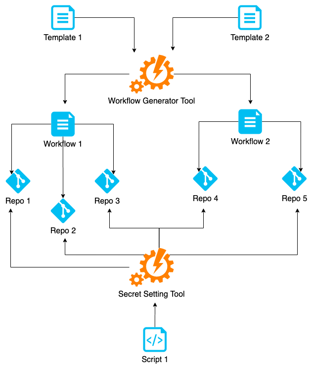

.. workflow-tools documentation master file, created by
   sphinx-quickstart on Mon Mar 30 17:48:48 2020.
   You can adapt this file completely to your liking, but it should at least
   contain the root `toctree` directive.

workflow-tools
==============

CLI tools for GitHub Actions.

- Automate writing GitHub workflow configs with a generator tool
- Automate setting GitHub secrets for repositories
- Integrate the tools into your pipeline for setting up new microservices

Rationale
---------

Microservice architecture may have dozens and dozens of lookalikes services that require similar CI/CD workflows.
With infrastructure as code approach taken by the `GitHub Actions`_, why not using workflows generation?
Provisioning repository for a new microservice may also be automated. This is where ``workflow-tools`` come in handy.

Examples
--------

Let's set `GitHub Secrets`_ for a repository. First, get a `personal access token`_ in GitHub settings.
Then set up a secret using ``workflow-tools``:

.. code-block:: bash

  workflow_secret --owner=anna-money --repo=workflow-tools \
    --token="YOUR-PERSONAL-ACCESS-TOKEN" \
    update --key=MY_SECRET_KEY --value=MY_VALUE

Now let's use a fragment of `Jinja2`_ template for a GitHub Actions workflow to generate resulting config:

.. code-block:: bash

  WORKFLOW_RUNNER_VERSION=ubuntu-18.04 WORKFLOW_PYTHON27=2.7 WORKFLOW_PYTHON37=3.7 \
  workflow_generator
  # Press Enter to start pasting Jinja2 workflow template into stdin
  jobs:
    test:
      runs-on: [[ workflow.runner_version ]]
      strategy:
        matrix:
          python:
            - [[ workflow.python27 ]]
            - [[ workflow.python37 ]]
  # Press Ctrl+D to render resulting workflow
  # For real workflow templates use reading/writing from/to a file, load variables from envfile
  jobs:
    test:
      runs-on: ubuntu-18.04
      strategy:
        matrix:
          python:
            - 2.7
            - 3.7

See :ref:`examples-docs` for a detailed tour on using ``workflow-tools`` in the real world.

.. _user-docs:

.. toctree::
   :maxdepth: 2
   :caption: User Documentation

   install
   workflow-tools
   examples

.. _dev-docs:

.. toctree::
   :maxdepth: 2
   :caption: Developer Documentation

   contributing
   changelog

.. _GitHub Actions: https://help.github.com/en/actions
.. _GitHub Secrets: https://help.github.com/en/actions/configuring-and-managing-workflows/creating-and-storing-encrypted-secrets
.. _personal access token: https://github.com/settings/tokens
.. _Jinja2: https://jinja.palletsprojects.com/
